# locked.in Design Document

## 1. Overview

### Purpose

locked.in is a social workout tracking app that provides a platform for groups of people to compete and collaborate in distance-scaled workout challenges.

### Target Users 

This app is inspired by and designed around distance-based cardio workout challenges held by the UCSD Dragon Boat team during school breaks. The target users are small to medium groups within preexisting communities, such as sports teams and personal training groups, whose members may prefer different activities (running, hiking, rowing) and use different tools to track workouts (Strava, Apple Fitness, etc.).

### Problems Addressed 

locked.in seeks to address several administrative issues encountered by teammates in previously used systems such as Google Sheets and Google Forms:

1. Coaches described lagging timelines and difficulty setting up complex Excel systems and manually maintaining leaderboards.
2. The current system uses Google Forms associated with specific email addresses to calculate totals. This can result in incorrect totals if a participant accidentally submits an activity using a secondary email, requiring an Admin to make a manual correction.
3. Current participation in cardio challenges is decreasing, from roughly half the team in previous years to less than 10% this year. Coaches cite concerns with activity range (not everyone enjoys running as conditioning) and a general disinterest in logging. 

### Goals

locked.in aims to:

1. Setup Time: Reduce the time required to create and manage a workout challenge by providing presets and simple administrative settings.
2. Individual Management: Give participants control over their own activity records, allowing them to log, edit, and delete their own entries.
3. Activity Scaling: Make challenges accessible to participants who prefer different sports, providing sport scaling to make different activity types comparable. 
4. Notifications: Reduce the need for coaches to send reminders and progress updates manually through an automated notification system. 

### Non-Goals

At this point, locked.in does not seek to resolve these issues:

1. Direct Activity Tracking: locked.in does not seek to directly track activities using timers or GPS systems like Strava or Apple Fitness.
2. Ability Scaling: Different participants may have different inherent physical abilities (distance runner vs beginner). At this time, locked.in does not provide additional activity scaling beyond sport scaling. 
3. Guaranteed Engagement: locked.in can reduce barriers to participation and provide reminders, but it cannot guarantee that members will remain motivated. Broader gamification features, such as achievements, rewards, and daily quests, are outside the initial scope.
4. Automated Verification: Beyond requiring a proof photo, locked.in will not process the image to determine whether it matches the participant's submitted measurement. The photo is provided for Admin review and Participant reference only.

## 2. Product Design

### Terminology 

User: a person with a locked.in account.

Admin: a user who has administrative power over a challenge (see next section)

Participant: a user who is participating in a challenge (see next section)

Challenge: a timed competition or collaborative goal with a Challenge Mode, settings, Participants, and Admins to which Activities are logged. A Challenge can contain up to 100 active members in v1.

Challenge Mode: the type of Challenge. It determines which settings are available, how progress or winners are calculated, which notifications are sent, and how progress is displayed.

Furthest Wins: a Challenge Mode where distance is calculated individually and Participants compete against one another (see Challenge Modes for more details).

Group Goal: a Challenge Mode where all Participants work toward shared Milestones and a Goal, and individual participation is calculated as a percentage of the group's total progress (see Challenge Modes for more details).

Milestone/Goal: available in the Group Goal Challenge Mode. The Goal is the Challenge's final target. Milestones are optional intermediate targets placed before the final Goal.

Join Code: a six-character code used to join a Challenge. It is generated from Crockford's Base32 characters when the Challenge is created and does not change.

Activity: an entry submitted by one participant to one challenge. It contains a raw measurement, activity date (set by the participant and restricted to the challenge period), entry date (automatically recorded by the database), sport (which must be allowed by the challenge), and optional proof photo. An activity can only be connected to one challenge.

Raw Measurement: the original value and unit entered by the participant. Distance-based sports use kilometers or miles, while time-based sports such as weightlifting use minutes. The original value and unit are preserved when the activity is stored.

Canonical Measurement: a standardized version of the raw measurement used for calculations. Distances are converted to miles, while durations are stored in minutes.

Scaled Distance: the score produced after applying the challenge's sport-scaling rule to an activity's canonical measurement. The app displays scaled distances in miles or kilometers according to each user's preferred unit.

Sport: the type of exercise represented by an Activity. v1 will support running, paddling, swimming, and weightlifting.

### Default Sport Scaling

Running is the scoring baseline. locked.in provides the following default conversions, which an Admin can adjust while creating or managing a Challenge:

| Sport | Participant input | Default scoring rule |
|---|---|---|
| Running | Distance | 1 mile = 1 scaled mile |
| Paddling | Distance | 1 mile = 1 scaled mile |
| Swimming | Distance | 1 mile = 3 scaled miles |
| Weightlifting | Duration | 30 minutes = 1 scaled mile |

These conversions are approximate game-balancing defaults rather than claims that the Activities require exactly equal effort. They are informed by the relative activity-intensity ranges in the [2024 Adult Compendium of Physical Activities](https://pacompendium.com/adult-compendium/) and can be customized to fit a group's training goals.

### User Roles

In general, all users have the following abilities:

- set email (used for login; users who sign in through Google cannot change a password through locked.in)
- set display name (allows for duplicates)
- set/reset password 
- set profile photo
- set preferred units (km or mi)
- change theme (dark or light)
- delete account 

#### Challenge Roles

**Admin** roles have greater control over challenges. Any user can become an admin by creating a challenge or being given admin permissions by an existing admin.

Upon challenge creation, Admins have the ability to:

- set the challenge name
- select the challenge type (furthest wins, group goal)
- select the available sports
- set sport scaling 
- set timeframe 
- set milestones (for group goal)
- option to require proof photos

After challenge creation, Admins have the ability to:

- modify challenge name 
- modify available sports
- modify sport scaling 
- modify timeframe
- modify milestones
- turn on/off proof photo requirements
- view join code
- remove participants
- give participants admin permissions
- delete/edit any activities
- close the challenge early (announces results)
- delete the challenge (does not announce results)

After a Challenge starts, the following restrictions apply:

- The Challenge Mode cannot be changed.
- The name can be changed until the Challenge is finalized.
- The start date cannot be changed after any Activity has been submitted.
- The end date can be changed, but it cannot be moved to a date that would exclude an existing Activity.
- Sports can be added, but a Sport can only be removed if no Activities have been submitted for it.
- Sport-scaling rules can be changed after an Admin confirms a warning that all existing scores and standings will be recalculated.
- Changes to proof-photo requirements apply only to future Activity submissions.
- A Milestone can be changed only if the group has not already reached it.

**Participants** are regular members of a challenge. By default, anyone who joins the challenge through the code is automatically a participant. Admins retain all participant functions (they can also log activities).

An Admin may leave an active Challenge as long as at least one other Admin remains. The last remaining Admin must promote another Participant before leaving.

Participants can:

- join a challenge 
- log activities
- edit their own activities
- delete their own activities
- view all activities and leaderboards
- leave the challenge (deletes all entries)

An Activity can only be submitted before the Challenge deadline, even if the Activity itself occurred during the Challenge period. Late submissions are not accepted.

### Challenge Modes

**Furthest Wins** is a challenge mode meant to encourage competition.

Each participant's total is calculated by first applying sport scaling to their activities, then summing them together. All participants' totals are then compared in a leaderboard, with the top 3 participants on a podium. 

Specific notifications for this challenge mode include:

- Special notifications for entering 1st, 2nd, 3rd. 
- Logging notifications that include indications of how far ahead the next person is ("X is only 1 mi ahead of you!") or how far behind the person behind you is. ("Y is only 2 mi behind you!")
- Special notifications for when someone passes you, specifically in the top 5 ("X just took 3rd place, log an activity now to keep your position!")

The winner is the Participant with the greatest scaled distance when the Challenge is finalized. Participants with equal totals share the same placement. For example, if two Participants tie for first place, the next Participant receives third place.

**Group Goal** is a Challenge Mode meant to encourage collaboration.

All members work toward Milestones and a final Goal. Group progress is calculated by scaling all Participant Activities and adding them together. Each Participant's contribution is also calculated as a percentage of the current progress. Top contributors are highlighted.

Specific notifications for this challenge mode include:

- Special notifications for being the top 3 contributors. 
- Logging notifications that highlight how much distance to the next goal ("N miles until the next milestone!")
- Special notifications for when the group reaches a milestone ("Your Team just reached the X milestone!")

If the group goal is reached before the end of the challenge period, the admin will have the option to end the challenge early or allow it to continue until the end of the challenge period. If, at the end of the challenge period, the group goal is not reached, the admin will get notified to either extend the challenge period (second chance at reaching the goal), or end it, where then the progress will be determined as a percentage of the final goal achieved. At the end of the challenge period, regardless of group progress, top contributors will be recognized. 

### Challenge Time and Deadlines

When a Challenge is created, its timezone defaults to the timezone reported by the creator's device. The Challenge deadline is 11:59 p.m. on its end date in that timezone. The deadline is stored with the Challenge and displayed in each Participant's local timezone when necessary.

Activities must be submitted before the deadline. An Activity completed during the Challenge period but submitted after the deadline is not accepted.

### Notification Strategy

Notifications focus on meaningful events rather than every change in Challenge activity. This reduces notification fatigue and keeps alerts useful. Important events include reaching a Group Goal Milestone, being passed in a Furthest Wins Challenge, an approaching Challenge deadline, and an extended period without logging an Activity.

Notifications are shown in the app and may also be delivered as push notifications when the user grants permission. Users can disable optional competitive and reminder notifications. Administrative changes to a Participant's Activity always generate an in-app notification explaining whether the Activity was edited or deleted and which Admin performed the action.

## 3. Technical Design

### System Overview

locked.in will consist of a React Native mobile application connected to Supabase. The mobile application will display the user interface and collect user input. Supabase will provide authentication, database storage, photo storage, access control, and trusted backend operations.

### Mobile Frontend

The mobile frontend will be built using React Native, Expo, TypeScript, and Expo Router. A shared frontend codebase will support both iOS and Android, which are the primary platforms for locked.in. The frontend will display leaderboards, podiums, challenge progress, activities, and other visual elements. It will also provide forms for actions such as challenge creation and activity logging.

The frontend will perform basic form validation to provide immediate feedback, but it will not have final authority over permissions or scoring. Those rules will be enforced by Supabase so that a modified frontend cannot submit unauthorized or incorrectly scaled data.

### Supabase Database, Authentication, and Storage

Supabase Auth will manage email/password and Google authentication. Its PostgreSQL database will store profiles, challenges, memberships, allowed sports, milestones, activities, and notifications. Supabase Storage will hold profile images and activity proof photos.

Supabase Row Level Security will enforce which records each signed-in user can view or modify. Database queries, views, or functions will calculate challenge totals and leaderboards by grouping activities by challenge and participant.

### Trusted Backend Operations

Supabase Edge Functions or database functions will handle operations that require trusted validation, calculations, or multiple database changes. These include creating a challenge and generating its unique join code, joining a challenge, validating activity submissions, applying sport-scaling rules, and generating scheduled notifications.

Sport scaling and leaderboard totals will be calculated when challenge progress is requested. This allows an Admin to change a sport-scaling rule without rewriting every stored activity. Changing a rule will affect the calculated scores of all previous activities in that challenge, so the app will warn the Admin before confirming the change.

### Main Data Flows

#### Creating a Challenge

1. The user enters the challenge settings in the mobile application.
2. The application includes the creator device's current timezone and sends the settings to a trusted backend function.
3. The backend validates the settings, confirms that the dates are valid, and generates a unique join code.
4. Supabase creates the challenge and gives its creator the Admin role.
5. The new challenge and join code are displayed in the application.

#### Joining a Challenge

1. The user enters a join code.
2. The backend finds the associated challenge.
3. It confirms that the Challenge is active, has fewer than 100 members, and can still accept Participants.
4. Supabase creates a Participant membership for the user.
5. The application opens the challenge dashboard.

#### Logging an Activity

1. The participant submits the sport, raw measurement, activity date, and optional proof photo.
2. The backend confirms that the participant belongs to the challenge.
3. It verifies that the sport is allowed, the unit is valid for that sport, and the date falls within the challenge period.
4. The backend validates that the raw unit matches the selected Sport's measurement type.
5. The raw value, raw unit, and remaining Activity information are saved.
6. The application requests and displays the challenge's updated progress.

#### Displaying Challenge Progress

1. The application requests progress for a challenge.
2. The database finds the challenge's activities and corresponding sport-scaling rules.
3. Each activity's canonical measurement is converted into a scaled distance using its sport's current scaling rule.
4. The database groups and sums the results according to the challenge mode.
5. Results are converted into the signed-in user's preferred display unit.
6. The totals are returned to the application.

## 4. Data and Security

### Entities 

locked.in stores the following main types of information:

- **Profile:** A user's display name, profile photo, and preferred units.
- **Challenge:** A Challenge's name, mode, dates, timezone, status, and settings.
- **Membership:** Connects a User to a Challenge and identifies them as a Participant or Admin.
- **Allowed Sport:** Defines a Sport that can be submitted to a Challenge and the scaling rule applied to it.
- **Activity:** A workout submitted by one user to one challenge.
- **Proof Photo:** A private image associated with an activity and stored in Supabase Storage.
- **Milestone:** An intermediate or final target for a Group Goal challenge.
- **Notification:** An in-app message intended for one user.

A User can belong to many Challenges, and a Challenge can contain many Users. A Membership connects one User to one Challenge and records whether that User is a Participant or Admin in that Challenge.

Each Activity belongs to exactly one User and one Challenge. A Challenge can define multiple Allowed Sports and, for Group Goal challenges, multiple Milestones. A Notification belongs to one User and may reference one Challenge.

### Access Control

Supabase Row Level Security will enforce access based on the signed-in user and their challenge memberships.

Users can edit only their own profiles. A Profile's display name and profile photo are visible to users who share a Challenge with that Profile. Private authentication information, including email addresses, is not displayed to other members.

Users can view active Challenges they have joined and finalized Challenges in which their Membership is preserved. Only members of an active Challenge can submit or modify Activities. Participants can create, edit, and delete their own Activities. Challenge Admins can modify Challenge settings and manage all Activities and Memberships within that Challenge. Admin permissions apply only within the relevant Challenge. If an Admin edits or deletes another Participant's Activity, that Participant receives an in-app Notification identifying the change and the Admin who performed it. Users can view only Notifications addressed to them.

### Photo Privacy

Proof photos will be stored privately in Supabase Storage. A proof photo can be viewed by the Participant who uploaded it and by Admins of its associated Challenge. Other Participants cannot view it. Users lose access to Challenge proof photos when they leave the Challenge. Deleting an Activity will also delete its proof photo.

### Deletion Behavior

Deleting an Activity removes it from Challenge progress and deletes its proof photo.

Any Admin of a Challenge can finalize or delete it. The user who originally created the Challenge does not retain a separate owner role or special permissions. Before deletion, the application will display a confirmation explaining that the Challenge's Memberships, Activities, Milestones, Notifications, and associated photos will be permanently removed. This action cannot be undone. Deleting the entire Challenge is the only exception to the rule that finalized Challenges cannot be modified.

When a Participant leaves an active Challenge, their associated Activities and proof photos are deleted, and Challenge progress is recalculated.

When an account is deleted, its Profile and proof photos are deleted and the user is removed from all active Challenges. Their Activities in active Challenges are also deleted. Scores and contributions in completed Challenges are preserved under an anonymous "Deleted User" identity so that finalized results do not change.

### Challenge Finalization

When a Challenge reaches its end date, Activity submission and editing are temporarily disabled. Furthest Wins Challenges are finalized automatically and their winners are announced. If a Group Goal Challenge has not reached its goal, an Admin may extend its end date or finalize the existing result.

Once finalized, a Challenge becomes a frozen, read-only record. Activities, Memberships, scoring rules, and results can no longer be created, edited, or deleted individually. An Admin may still delete the entire Challenge. If a Participant later deletes their account, their display name and other identifying information are removed from the completed Challenge, but their score remains under an anonymous "Deleted User" identity. This preserves the Challenge's final standings and Group Goal progress.

## 5. User Interface

### Important Screens

The app opens to the Login screen when no authenticated session is available. Signed-in users open directly to the Main Dashboard.

Login: email, password, Google authentication, and reset password option.

Create Account: email, password, or Google authentication. After authentication, the user is prompted to choose a display name and optional profile photo.

Main Dash: top right settings, greeting, challenge feature (soonest to end challenge), followed by cards for current challenges, past challenges. 

Create Challenge: Challenge Mode, name, allowed Sports, time period, timezone, and proof-photo requirement. The next screen contains sport-scaling options. After creation, the Join Code is displayed.

Join Challenge: input boxes for the six-character Join Code.

Challenge Dashboard, Furthest Wins: back navigation in the upper-left corner and Challenge settings in the upper-right corner. A podium and leaderboard with progress bars can open into a full standings screen. The Activity feed appears below, with an Add Activity button in the lower-right corner.

Add Activity: Activity date, Sport, raw measurement and unit, and optional or required proof photo. The entry date is generated automatically.

### Mockups 

Login:

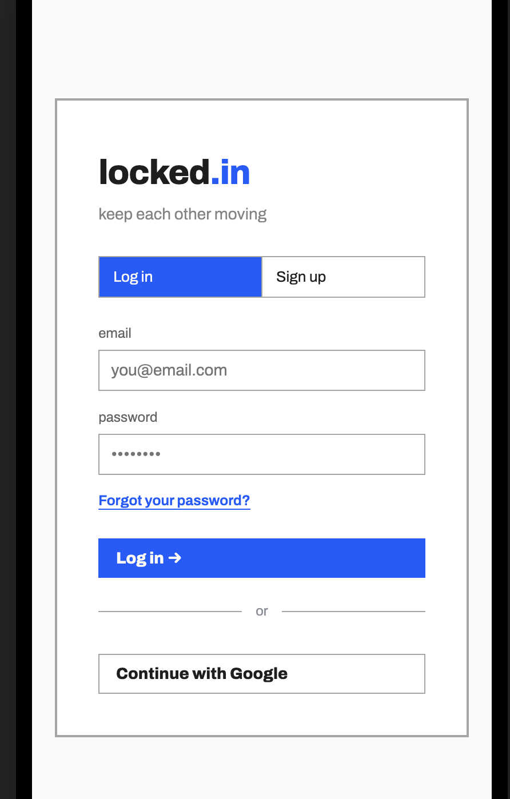

Challenge feature/current challenges

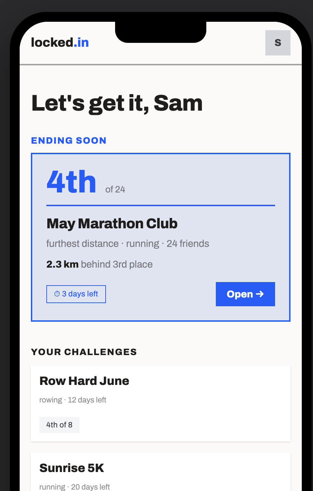

Add Challenge/finished challenges

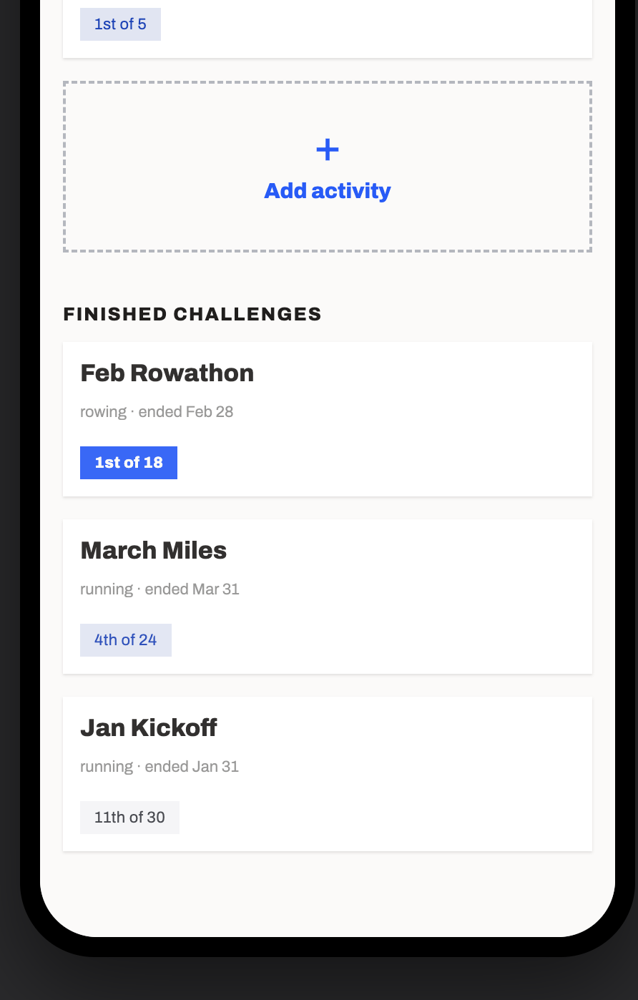

Create Challenge

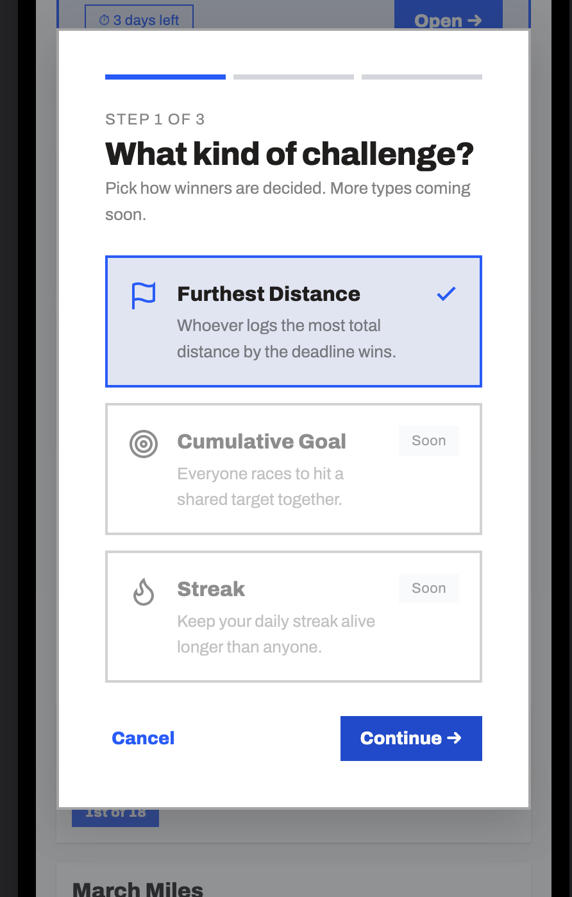

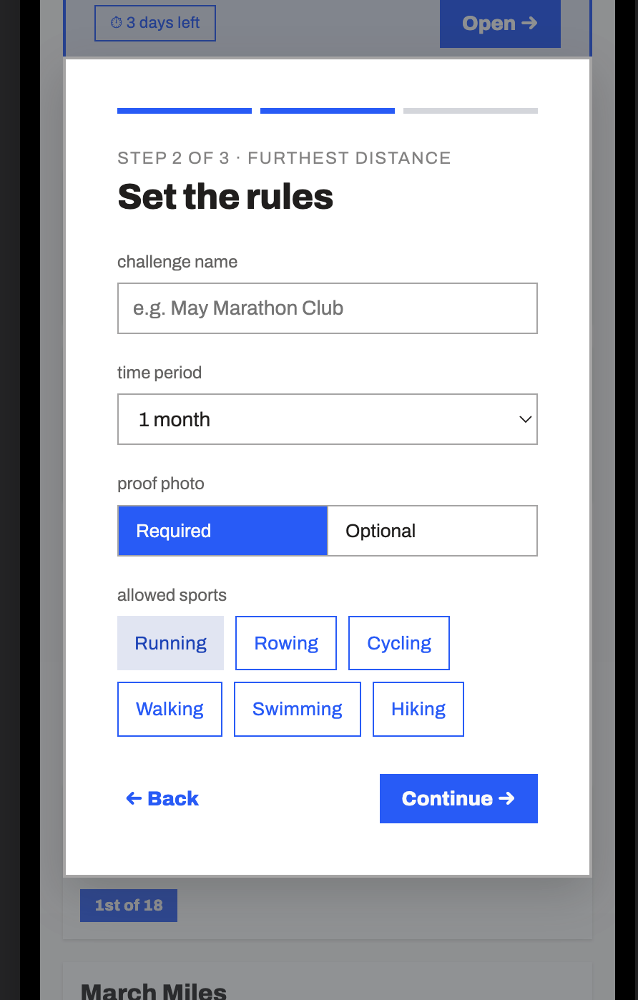

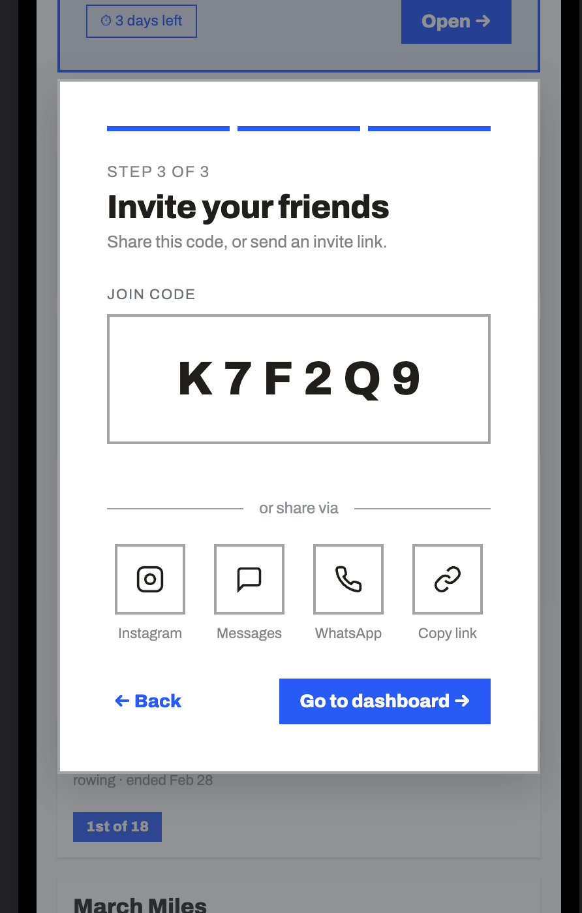

Dashboard (Furthest Distance):

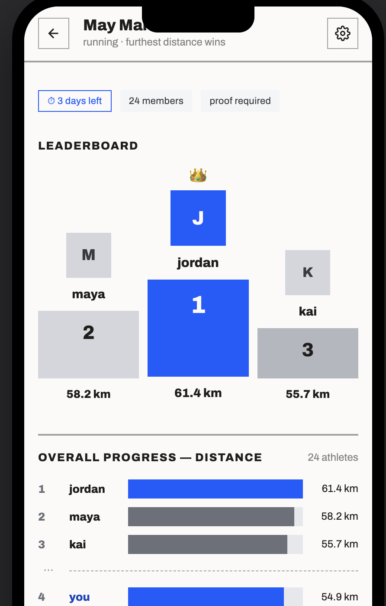

View Activities:

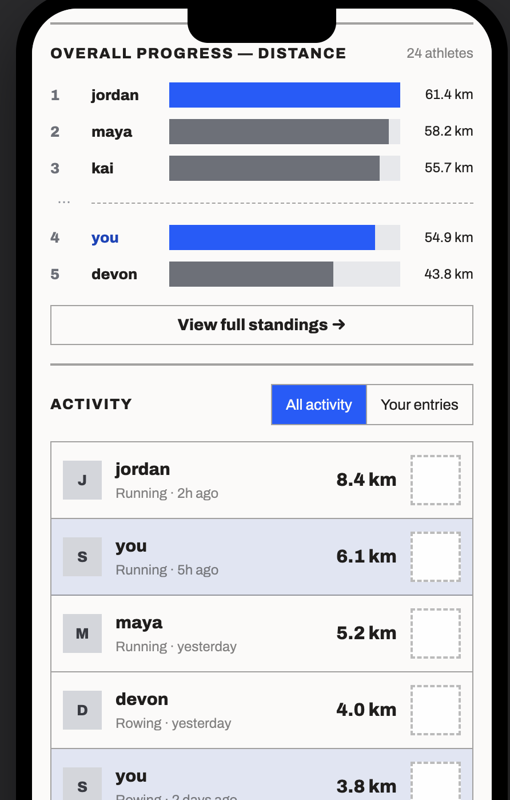

Full Standings (Furthest Distance):

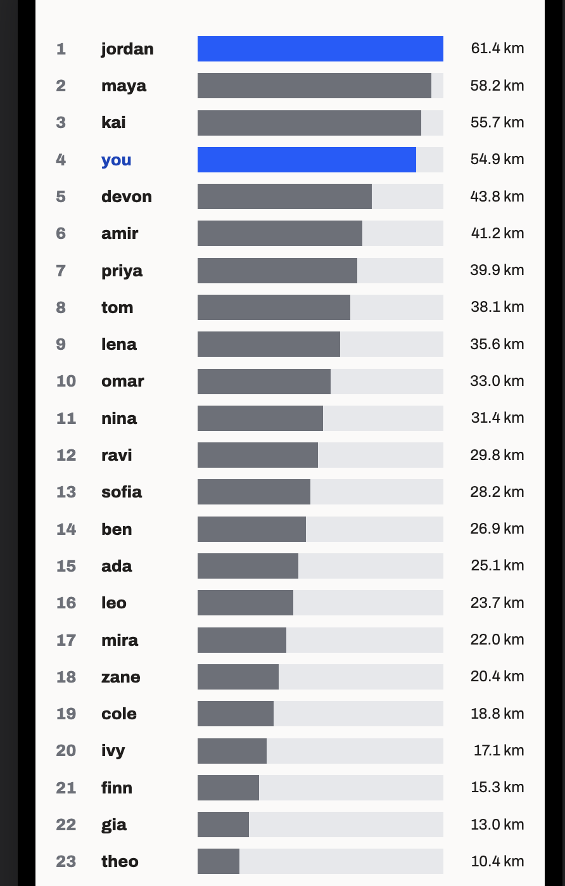

Add Entry:

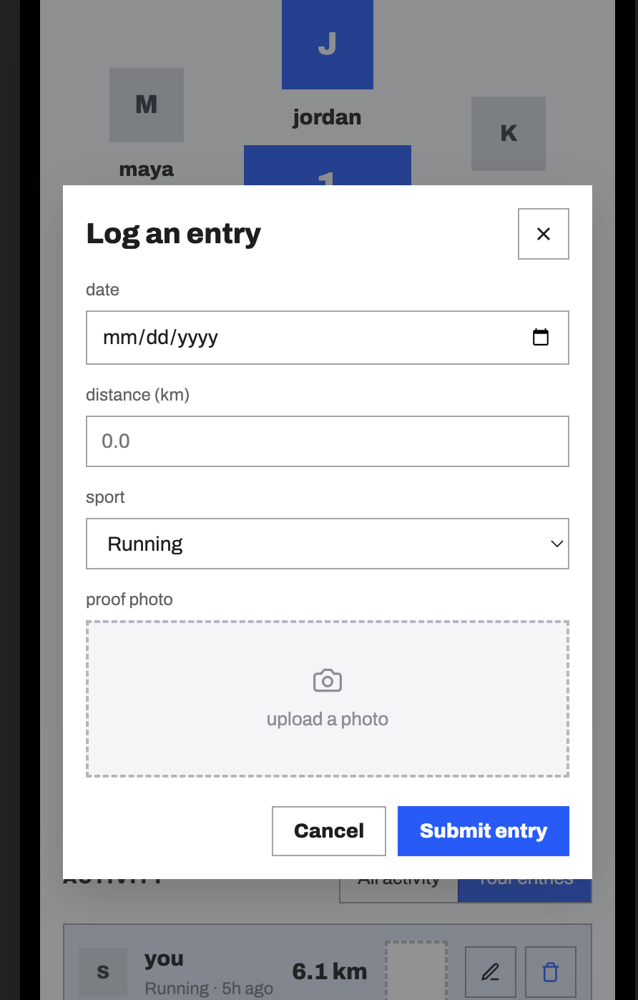

Dark Mode:

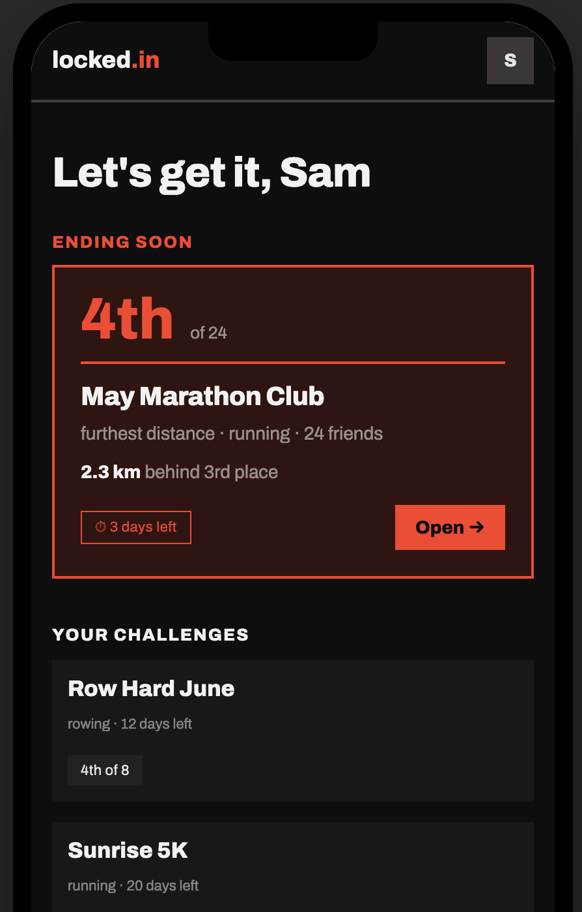

### Visual Design Principles

The interface uses bold colors, participant photos, and prominent progress displays to create a social and athletic tone. Furthest Wins emphasizes individual placement, while Group Goal emphasizes shared progress and Milestones. Both modes retain consistent navigation and Activity logging patterns.

Activity logging prioritizes speed and clarity. Required fields appear before optional fields, and ordinary submissions should not require navigation through multiple screens. Color is not used as the only way to communicate errors, placement, or progress; text and icons provide the same information where necessary.

### Mobile and Responsive Behavior

locked.in is designed mobile-first for iOS and Android. Content uses a single-column layout on narrow screens, forms use touch-friendly controls, and primary actions such as logging an Activity remain easy to reach. The shared Expo frontend may also support web layouts, but the mobile experience is the v1 priority.

Loading states use skeleton screens with left-to-right gradients. Progress bars fill from left to right and may animate when updated. Light and Dark modes default to the user's system setting and can be overridden in account settings.

## 6. Limitations and Future Work

### Current Risks and Tradeoffs

- Activity and photo storage will grow over time, especially because finalized Challenges preserve their results. Proof photos are likely to consume substantially more storage than Activity records.
- Sport conversions make different Activities comparable for game scoring but cannot account perfectly for intensity, conditions, or individual ability.
- Changing a scaling rule during an active Challenge recalculates previous scores and may significantly change the standings.
- locked.in depends on Supabase for authentication, storage, and core application data. A Supabase outage may temporarily prevent login or Activity logging.
- Manually submitted Activities can contain inaccurate information. Proof photos assist human review but are not automatically verified.

### Future Work

Some features have been considered but will not be included in v1:

- automated proof-photo checks for Activity entries
- ability-based scaling based on a Participant's fitness level
- additional Challenge Modes, such as games or team-versus-team competition
- additional Sports, such as biking, hiking, walking, and HIIT
- assigning one Activity to multiple Challenges; in v1, it must be submitted separately to each Challenge
- custom Join Codes
- hiding or archiving Challenges without deleting them
- allowing users to manually choose which Challenge is featured on the Main Dashboard
